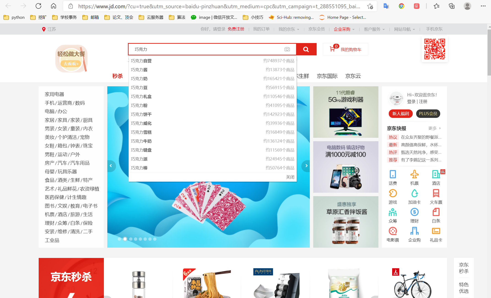
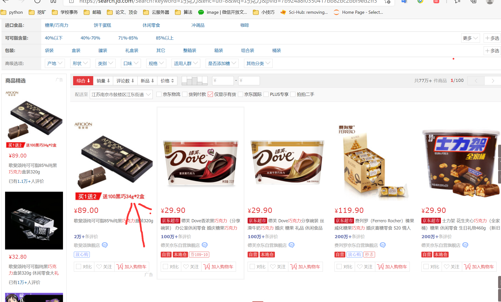
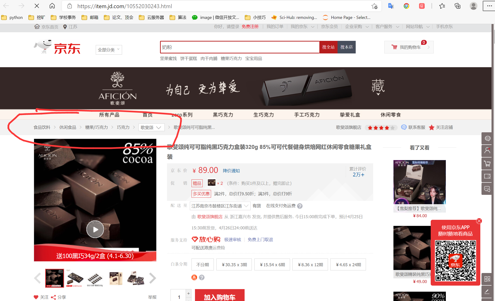

# 利用爬虫爬取狗东类别信息

不想做手动标注的肝王，可以来爬虫

## 先bb几句  

测试了很多家购物网站，基本上都没有分类的接口  
狗东就有，那么我们就可以通过爬虫实现自动分类，只要那个商品能搜到，我们就可以进去爬。  
准确率可以达到90%，就是为了完成这个作业，后期我们还要进行人工修饰。我自己分的结果已经  
贴到仓库了。(.csv文件)一个是爬下来稍微修改的，一个是我最终用来关联分析的列表  
为了查重，大家可以自己尝试着再在初始列表中再修改，毕竟有5%-10%的分类是错误的  
还有分的太细了，这不利于关联规则挖掘。

# 实现原理
我的想法是这样的：想要的到一个商品的类别  

## 第一步：到京东搜索

首先我们看京东的搜索界面  
-   

## 第二步:选第一个商品

-   
京东的搜索出来的第一页的第一个商品一般与我们的搜索目标相似度最高  
但不排除有竞价因素。这个就不管了，这里要提一句，老师给我们的数据里有香烟  
这玩意京东不给卖，所以我们单独拿出来标注（excel按商品货号排序，）你会得到结果  ；
通过爬虫解析第一个商品的网址

## 第三步:进入商品的网址爬取类别

-   
进入到商品详情，我们会发现商品的类别再左上角，我们需要做的就是爬取他的类别  

##  强烈建议！！！

京东反爬贼强，一定要设置爬取的速度，我代码里time.sleep()函数。  
然后我们一台电脑的代理撑死爬800多，建议分阶段爬取  
还有针对反爬虫，找代理，建立代码池坑太多  
本来这个作业很快就能完成，搞代码池搞的崩溃，建议条件的氪金找好代理。  
对付这个作业是绰绰有余2000多条很好搞。。多找几台电脑分阶段跑就行

# 肝不易，希望观众老爷们点点右上角的小星星 Star一下
